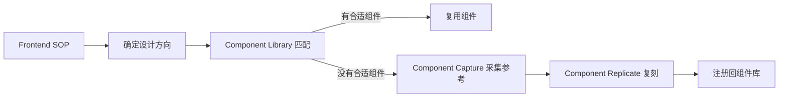

# AI Design System Toolkit

这是一套面向 AI Coding 的 Design System 工作流示例，把“先定义设计方向、再采集优秀组件、最后优先复用组件库”串成一条完整链路。

## 三个组成部分

| 模块 | 作用 | 入口 |
|---|---|---|
| Frontend SOP Skill | 在写前端代码前先确认设计方向，并把任务路由到合适的技能 | `frontend-sop-skill/frontend-sop/SKILL.md` |
| Component Capture Extension | 在浏览器中选择页面元素，采集 DOM、样式、页面信息和截图，并配套组件复刻 Skill | `component-capture-extension/` |
| Component Library Skill | 根据页面需求匹配已有组件库，优先复用而不是从零生成 | `component-library-skill/component-library/SKILL.md` |



## 目录结构

```text
.
├── frontend-sop-skill/
│   └── frontend-sop/SKILL.md
├── component-capture-extension/
│   ├── extension/
│   └── skill/SKILL.md
└── component-library-skill/
    └── component-library/
        ├── SKILL.md
        └── references/
```

## 使用提示

### Skills

把所需 Skill 文件夹复制到你的 AI Coding 工具所支持的 skills 目录，并根据实际项目修改组件库路径、设计规范名称和触发词。

### 浏览器扩展

1. 打开 Chromium 系浏览器的扩展管理页。
2. 开启开发者模式。
3. 选择“加载已解压的扩展程序”。
4. 选择 `component-capture-extension/extension/`。

扩展默认把采集结果发送到 `http://localhost:54321/api/capture`。本仓库不包含对应的本地服务端实现，使用前需要提供兼容接口。

## 安全与隐私

- 上传前已扫描常见密钥、令牌、密码、私钥、邮箱和本机绝对路径。
- 已移除 3 处包含本机用户名的绝对路径。
- 扩展会采集所选元素的 DOM、计算样式、页面 URL、页面标题和当前可见区域截图。
- 扩展清单包含 `<all_urls>` 权限；只应在你有权采集的页面上使用。
- 如把本地接口改为远程服务，应先增加 HTTPS、身份验证、数据脱敏和明确的用户确认机制。

详细结果见 `SECURITY_REVIEW.md`。

## 说明

- 这是工作流和原型示例，部分路径、组件库和服务端接口需要按实际环境配置。
- 仓库当前未声明开源许可证；在补充许可证前，默认保留全部权利。
